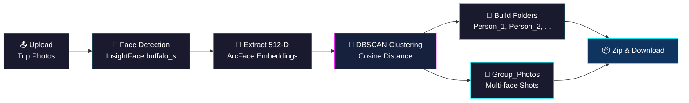

# 📸 Trip Photo Organizer AI

<p align="center">
  
  
  
  
  
</p>

<p align="center">
An automated, AI-powered Streamlit web application that scans a batch of unorganized trip photos, detects human faces, extracts 512-dimensional feature embeddings, clusters individuals using DBSCAN, and organizes the photos into person-wise folders and group photo directories.
</p>

---

## 🧭 Pipeline Overview



---

## 🚀 Key Features
* **Face Detection & Vector Extraction:** Utilizes InsightFace (`buffalo_s` ONNX model) to extract normalized 512-D ArcFace face embeddings.
* **Unsupervised Clustering:** Uses DBSCAN with cosine distance metric to group identical individuals without requiring pre-labeled training data.
* **Smart Folder Structuring:** Automatically generates person-specific directories (`Person_1`, `Person_2`, etc.) and a dedicated `Group_Photos` folder for multi-face shots.
* **One-Click Download:** Compresses the full organized folder structure into a downloadable `.zip` file directly within Streamlit.

---

## 🛠️ Tech Stack
* **Language:** Python 3.10+
* **Frontend/UI:** Streamlit
* **Computer Vision & AI:** InsightFace, OpenCV, NumPy, Pillow
* **Clustering Engine:** scikit-learn (DBSCAN)

---

## 📂 Project Structure
```text
project/
├── app.py                  # Main Streamlit UI & pipeline controller
├── requirements.txt        # Project dependencies
├── utils/
│   ├── detector.py         # InsightFace model loading & embedding extraction
│   ├── cluster.py          # DBSCAN face embedding clustering
│   ├── organizer.py        # Disk directory builder & image file copying
│   └── zipper.py           # In-memory ZIP archive generation
└── README.md
```